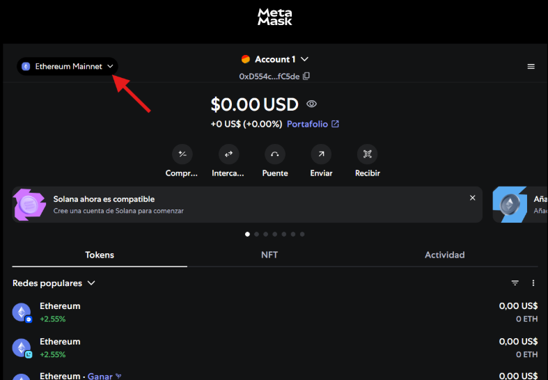
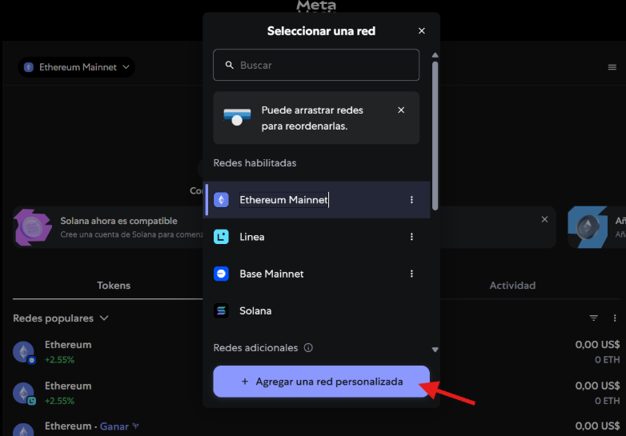
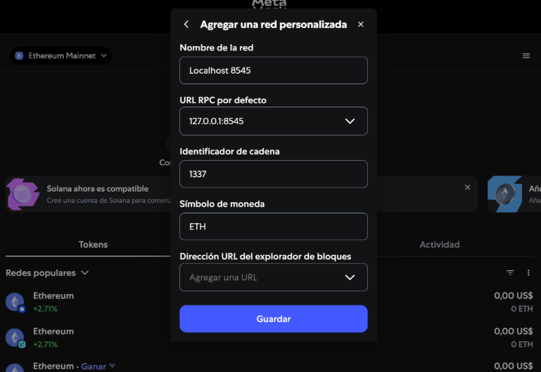
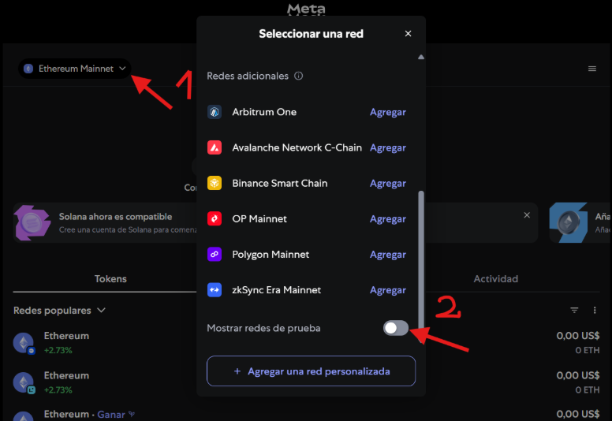
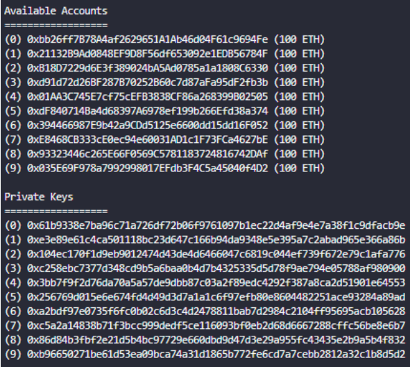
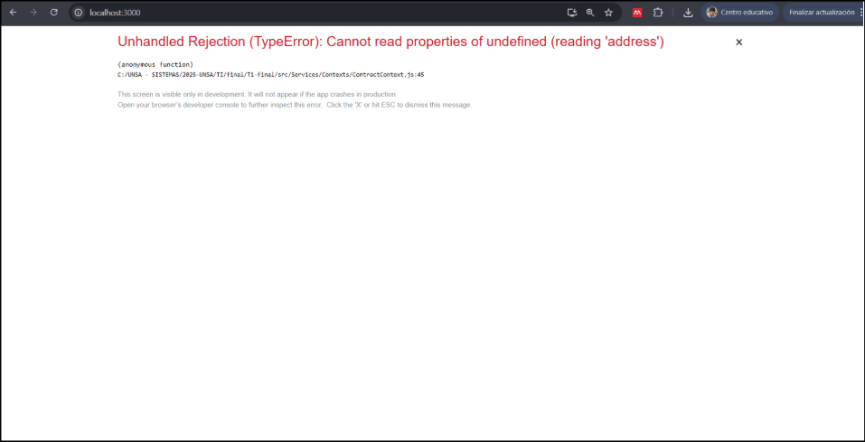
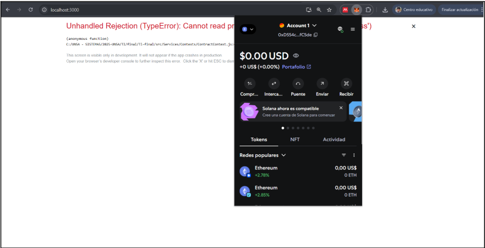
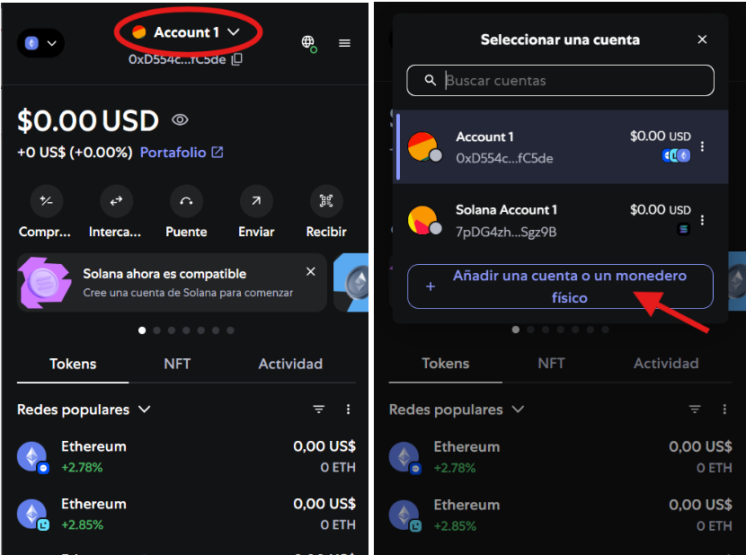
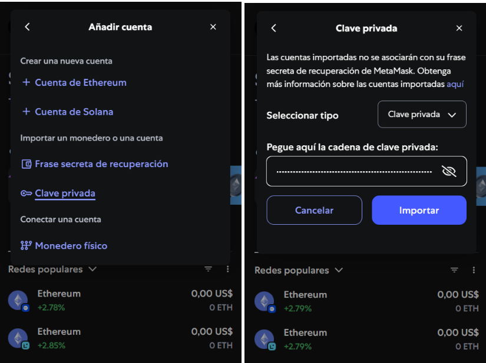
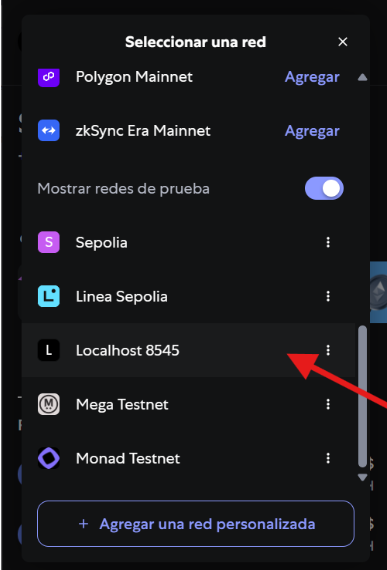

# Sistema de Trazabilidad Blockchain - Cadena de Suministro

## CLONACIÓN DEL PROYECTO

Primero clonamos el proyecto usando el siguiente comando: 
```bash
git clone https://github.com/ahilacondo/Ti-final.git
```

Luego navegamos al directorio del proyecto: 
```bash
cd Ti-final
```

## REQUISITOS PREVIOS

Antes de proceder con la instalación, asegúrese de tener instalado:
- Node.js
- Git 
- Un navegador web moderno (Chrome, Firefox, Edge)

Para verificar las versiones instaladas: 
```bash
node --version 
npm --version 
git --version
```

## INSTALACIÓN DE DEPENDENCIAS GLOBALES

Instale Truffle y Ganache CLI globalmente:
```bash
npm install -g truffle
npm install -g ganache-cli
```

Verifique las instalaciones:
```bash
truffle version
ganache-cli --version
```

## CONFIGURACIÓN DE METAMASK

Nos dirigimos a **[Instalar extensión](https://chromewebstore.google.com/detail/metamask/nkbihfbeogaeaoehlefnkodbefgpgknn)** y la instalamos.

Una vez instalado nos dirige a crear una cuenta

Seleccionamos "Crear un nuevo monedero"

Creamos una contraseña, se recomienda "proyectofinal"

Después proporciona una frase secreta, la guardamos

Nos redirige a un panel de control de la extensión, se recomienda no cerrarla

Crearemos un red nueva, para ello nos dirigimos a:




En nombre de red colocamos:
**Localhost 8545**

En URL RPC seleccionamos agregar y colocamos:
**http://127.0.0.1:8545**

En identificar de cadena colocamos:
**1337**

Y en símbolo de moneda colocamos:
**ETH**



Una vez creada volvemos a dirigirnos a:



Y seleccionamos la que acabamos de crear Localhost 8545

## CONFIGURACIÓN DEL BLOCKCHAIN LOCAL

Ejecute Ganache: 
```bash
ganache-cli -p 8545
```

Mantenga esta terminal abierta durante todo el proceso de desarrollo.

Es recomendable guardar las Private Keys que aparecen en consola por ejemplo:



## CONFIGURACIÓN DE SMART CONTRACTS

En una nueva terminal, navegue al directorio de contratos inteligentes: 
```bash
cd src/Smart-Contract
```

Instale las dependencias: 
```bash
npm install
```

Compile los contratos: 
```bash
truffle compile
```

Despliegue los contratos en la red local:
```bash
truffle migrate --reset --network development
```

## INSTALACIÓN DEL FRONTEND

Regrese al directorio raíz del proyecto:
```bash
cd ../..
```

Instale las dependencias del frontend:
```bash
npm install
```

## EJECUCIÓN DE LA APLICACIÓN

Inicie la aplicación React: 
```bash
npm start
```

La aplicación se abrirá automáticamente en http://localhost:3000

Debería aparecer algo similar:



Nos dirigimos a extensiones



Nos dirigimos a account para añadir una cuenta:



De las Private Keys que guardamos antes seleccionamos la primera (0) y añadimos:



Actualicemos http://localhost:3000 seguramente les pedirá conectar la cuenta, se coloca aceptar. En caso siga saliendo error no olvidar de cambiar de red:



## CONFIGURACIÓN INICIAL DE DATOS

Para cargar datos de prueba tenga en cuenta lo descrito en el PASO 10

En otra consola ejecute:
```bash
cd src/Smart-Contract
```

Para los datos:
```bash
truffle exec Scripts/setup-app.js --network development
```

Esto creará usuarios de ejemplo, productos y transacciones para probar la funcionalidad.

## CUENTAS DE ACCESO

Las cuentas disponibles son las Private Keys que guardamos:


Por defecto la cuenta (0) es el administrador (siempre), pero al crear datos ficticios en el PASO 9 las demás cuentas se registrarán de manera automática, sin posibilidad de registrar alguna de estas cuenta como uno desee.

En caso ya se haya ejecutado los datos de prueba las cuentas se asignaron de la siguiente forma:
- **(0) Admin**
- **(1) Farmer**
- **(2) Farmer**
- **(3) Manufacturer**
- **(4) Manufacturer**
- **(5) Stakeholder**
- **(6) Stakeholder**
- **(7) Stakeholder**
- **(8) Stakeholder**
- **(9) Stakeholder**

Para acceder a una cuenta simplemente se debe añadir la cuenta como en el PASO 8, usando la Private Keys correspondiente.

